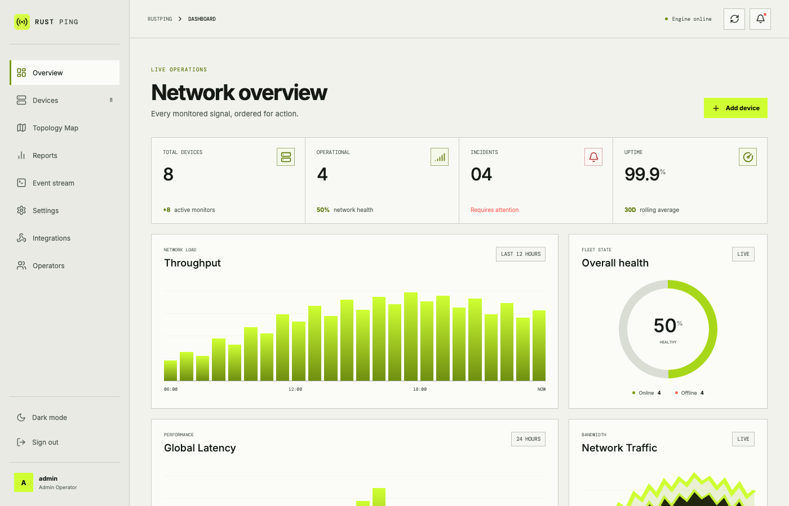
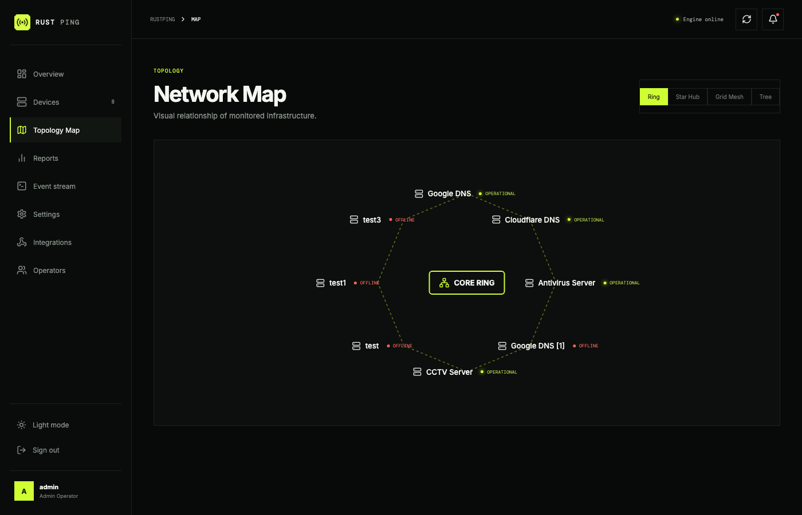
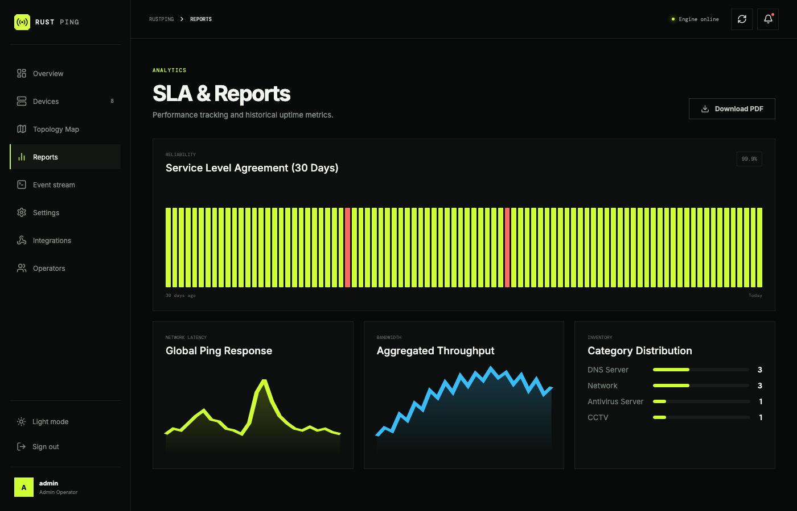
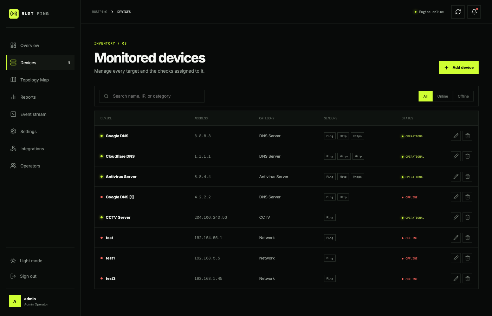
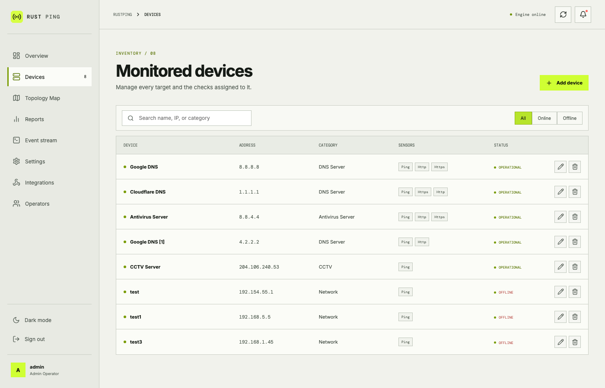

# RustPing: Real-Time Network & Infrastructure Operations Console

[](https://rustping.samsproject.in/)
[](https://www.rust-lang.org/)
[](https://rocket.rs/)
[](https://vuejs.org/)
[](https://opensource.org/licenses/MIT)

**RustPing** is an enterprise-grade, high-performance network device monitoring and operations console built with **Rust (Rocket framework)** and **Vue 3**. It provides real-time infrastructure tracking, parent dependency mapping, SLA analytics, alert webhooks, and live event diagnostic logging in a single responsive operations interface.

**Live Website / Production Deployment:** [https://rustping.samsproject.in/](https://rustping.samsproject.in/)

---

## Screenshots

### Operations Dashboard
| Dark Mode | Light Mode |
| :---: | :---: |
|  |  |

### Network Topology Map
| Dark Mode | Light Mode |
| :---: | :---: |
|  |  |

### SLA & Analytics Reports
| Dark Mode | Light Mode |
| :---: | :---: |
|  |  |

### Device Inventory & Management
| Dark Mode | Light Mode |
| :---: | :---: |
|  |  |

### Diagnostic Event Stream
| Dark Mode | Light Mode |
| :---: | :---: |
|  |  |

### Authentication Console
| Dark Mode | Light Mode |
| :---: | :---: |
|  |  |

---

## Key Features

* **High-Performance Engine:** Multi-threaded asynchronous sensor checks handling thousands of probes per second with minimal CPU and memory utilization.
* **Multi-Sensor Monitoring:**
  * **ICMP Ping:** Latency tracking, packet loss detection, and status history.
  * **HTTP/HTTPS:** Web service HTTP response code verification and endpoint checks.
  * **TCP Port Check:** Monitoring specific service ports (SSH, RDP, MySQL, Postgres, custom ports).
  * **SNMP Monitoring:** Querying network switch and router interface metrics.
  * **Bandwidth & Traffic:** Real-time aggregated throughput metrics.
* **Visual Topology Engine:**
  * **Ring Topology:** Circular loop linking adjacent nodes with a central core node.
  * **Star Hub:** Radial hub-and-spoke layout for gateway-centered networks.
  * **Grid Mesh:** Interconnected matrix mesh layout for rack environments.
  * **Tree Hierarchy:** Parent-child dependency tree rendering.
* **SLA & Reliability Analytics:** 30-day uptime heatmap, ping latency trend curves, category breakdown, and light-theme PDF report exporter with brand logos.
* **Live Diagnostic Event Stream:** Continuous raw evidence log stream with search filtering, CSV export, and administrative log clearing.
* **Alerting & Webhook Integrations:** Configurable alert routing supporting Slack, Microsoft Teams, PagerDuty, and SMTP Email dispatching.
* **Parent Dependency Trees:** Prevents alert cascades by suppressing child device notifications when a parent router or switch becomes unreachable.
* **Dual Console Themes:** Seamless switching between Dark Mode and Light Mode.

---

## Prerequisites

- **Rust:** Version `1.70` or higher ([rustup.rs](https://rustup.rs/))
- **Node.js & npm:** Node `18+` and npm `9+` (for compiling Vue 3 frontend assets)
- **Network Permissions:** RAW socket capabilities (on Linux, requires `CAP_NET_RAW` or elevated execution for ICMP ping probes).

---

## Installation & Build Guide

### Linux (Ubuntu / Debian / RHEL)

```bash
# 1. Clone the repository
git clone https://github.com/karthik558/Rust-Ping.git
cd Rust-Ping

# 2. Install dependencies and build the Vue 3 frontend
npm install
npm run build

# 3. Build the Rust backend release binary
cargo build --release

# 4. Grant ICMP Ping permissions to the binary for non-root execution
sudo setcap cap_net_raw=+ep ./target/release/RustPing

# 5. Execute RustPing
./target/release/RustPing
```

### macOS (Apple Silicon & Intel)

```bash
# 1. Clone the repository
git clone https://github.com/karthik558/Rust-Ping.git
cd Rust-Ping

# 2. Build frontend assets
npm install
npm run build

# 3. Build & Run via Cargo
cargo run --release
```

### Windows 10 / 11 (MSYS2 / MinGW)

```powershell
# 1. Clone repository
git clone https://github.com/karthik558/Rust-Ping.git
cd Rust-Ping

# 2. Build frontend assets
npm install
npm run build

# 3. Build Rust binary
cargo build --release

# 4. Execute RustPing
.\target\release\RustPing.exe
```

---

## Default Login Credentials

* **Username:** `admin`
* **Password:** `admin`

> [!IMPORTANT]
> Change the default password immediately after initial authentication under **Settings > Operators** or User Management.

---

## Device Configuration (`devices.json`)

Monitored assets are configured in `devices.json` in the root directory and can be updated through the Web UI modal or modified manually:

```json
[
  {
    "name": "Core Switch",
    "ip": "192.168.1.1",
    "category": "Network",
    "sensors": ["Ping", "Http"],
    "http_path": "http://192.168.1.1",
    "parent_device": null
  },
  {
    "name": "Application Server",
    "ip": "192.168.1.50",
    "category": "Linux Server",
    "sensors": ["Ping", "Http", "TcpPort"],
    "tcp_port": 8080,
    "parent_device": "Core Switch"
  }
]
```

---

## REST API Reference

RustPing exposes a RESTful JSON API endpoint suite:

| Method | Endpoint | Description |
| :--- | :--- | :--- |
| `GET` | `/` | Serves the single-page application console. |
| `GET` | `/devices` | Retrieves JSON array of monitored devices & active states. |
| `POST` | `/devices` | Adds a new device to the inventory. |
| `PUT` | `/devices/<id>` | Updates device IP, sensors, parent dependency, or category. |
| `DELETE` | `/devices/<index>` | Removes a device from monitoring. |
| `GET` | `/logs_json` | Returns real-time log entries in JSON format. |
| `DELETE` | `/logs` | Clears all historical event logs (Admin required). |
| `GET` | `/export_log` | Initiates CSV file download of monitoring log entries. |
| `GET` | `/api/email/config` | Fetches SMTP alert notification settings. |
| `POST` | `/api/email/config` | Saves SMTP configuration for alert dispatches. |

---

## License

Distributed under the **MIT License**. See `LICENSE` for details.

Maintained by the RustPing Project | [https://rustping.samsproject.in/](https://rustping.samsproject.in/)
