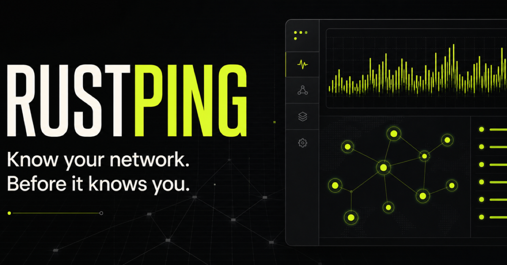

# RustPing Website

The official product website for RustPing, a precise, self-hosted infrastructure monitoring platform powered by Rust.

The site presents RustPing through a focused editorial system built around live telemetry, operational clarity, and technical performance. It includes the product overview, interface showcase, development roadmap, deployment guide, frequently asked questions, and MIT license terms.

[View the live website](https://rustping-monitor.chaises-toes-5e67b87.chatgpt.site)

## Product

RustPing gives infrastructure teams a clear view of network health without adding unnecessary complexity. Its asynchronous monitoring engine tracks device availability, response time, HTTP status, and operational events from a single self-hosted interface.

The website communicates four core product principles:

- Fast by design through an asynchronous Rust and Tokio core
- Live network state presented without visual noise
- Unified monitoring for local devices, public endpoints, and HTTP services
- Exportable event history for reporting and incident review

## Website Experience

The interface is designed as a professional technical product experience rather than a conventional software template.

- Responsive, editorial landing page
- Animated network telemetry and system-status visuals
- Product interface showcase using real RustPing screens
- Structured feature and roadmap sections
- Copy-ready deployment command
- Accessible FAQ interactions
- Dedicated license page
- Reduced-motion support
- Custom favicon and social preview assets

## Technology

| Layer | Technology |
| --- | --- |
| Application | React 18 and TypeScript |
| Build system | Vite |
| Styling | Tailwind CSS and custom CSS |
| Routing | React Router |
| Components | Radix UI primitives |
| Icons | Lucide React |
| Data utilities | TanStack Query |
| Production runtime | Cloudflare-compatible Worker entry point |

## Local Development

### Requirements

- Node.js 18 or newer
- npm

### Setup

Install the project dependencies:

```bash
npm install
```

Start the development server:

```bash
npm run dev
```

Open the local address printed by Vite in your browser.

### Production Build

Create an optimized production build:

```bash
npm run build
```

Preview the generated build locally:

```bash
npm run preview
```

Run the code quality checks:

```bash
npm run lint
```

## Project Structure

```text
RustPing-Website/
├── public/
│   ├── screenshots/       Product interface imagery
│   ├── favicon.png        Header-mark favicon
│   ├── og.png             Social sharing preview
│   └── rustping-logo.png  Exported transparent wordmark
├── server/
│   └── index.js           Production worker entry point
├── src/
│   ├── components/        Reusable interface components
│   ├── hooks/             Shared React hooks
│   ├── lib/               Application utilities
│   ├── pages/             Home, license, and fallback routes
│   ├── App.tsx            Routing and application providers
│   ├── index.css          Brand system and responsive styling
│   └── main.tsx           Browser entry point
├── index.html             Document metadata and favicon setup
└── package.json           Scripts and project dependencies
```

## Brand Assets

The repository includes production-ready brand exports:

- [`public/rustping-logo.png`](public/rustping-logo.png) — transparent full logo at 1600 × 400
- [`public/favicon.png`](public/favicon.png) — symbol-only favicon at 512 × 512
- [`public/og.png`](public/og.png) — social preview artwork

## Deployment

The production build outputs the static application and a Cloudflare-compatible worker entry point in `dist/`. Client-side routes fall back to `index.html`, allowing direct access to pages such as `/license`.

The `.openai/hosting.json` file connects this repository to its existing Sites project. Keep its project identifier unchanged when publishing future versions.

## License

RustPing is distributed under the MIT License. Review the complete terms in [`LICENSE`](LICENSE) or on the website’s dedicated license page.

Copyright © 2025 Karthik Lal.
